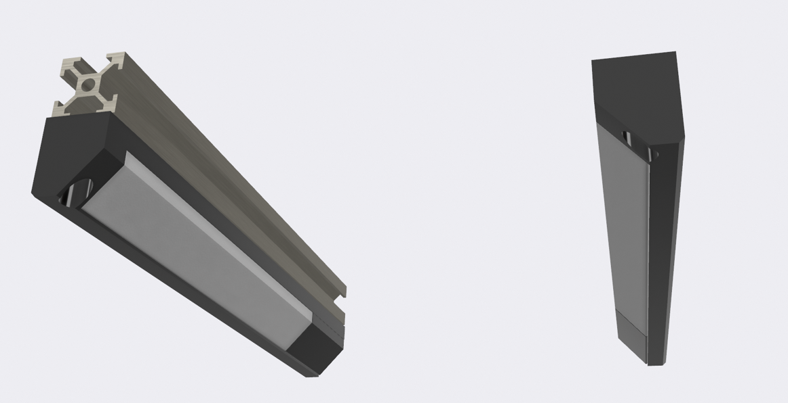
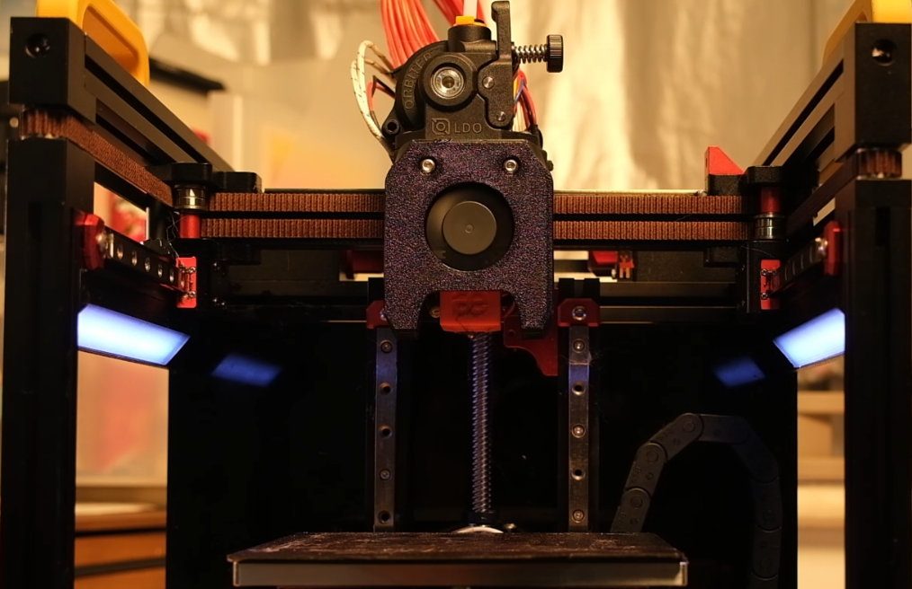

# voron-0 LED strip

A cool programmable RGB LED mod for voron-v0.

## Step
1. print stl files
2. use the soldering iron to connect 2 RBG boards
3. use the soldering iron to weld wires on the RGB board and build a 3in xh2.54mm Male connector
4. extent one wire from the `out` port of the lift RGB board
5. use M3x6 BHCS to fix RGB boards on the holder
6. lead the light cable from the `umbilical board` by 4pin xh2.54mm Male connector with 3pin xh2.54mm Female connector
7. connect the RGB boards by xh2.54mm connector. (PS, the `out` port wire on the left RGB board needs to be plugged into the 4pin xh2.54mm Male connector)
8. connect to the motherboard and check all the wire sequences of xh2.54mm connectors

### BOM
| **Item**                                                                               | **Qty.** |
| :------------------------------------------------------------------------------------- | :------- |
| [V0-Umbilical](https://github.com/VoronDesign/Voron-Hardware/tree/master/V0-Umbilical) | 1 kit    |
| M3x6 BHCS                                                                              | 8-12     |
| NeoPixel 8 x WS2812 5050 RGB LED                                                       | 4        |
| xh2.54mm connector Male&Female 3pin (option)                                           | 2        |
| xh2.54mm connector Male 4pin                                                           | 2        |
| xh2.54mm pitch female pin                                                              | 13       |
| magnet 4mmx3mm                                                                         | 10       |

### Tools
| **Item**        |
| :-------------- |
| Soldering Iron  |
| Crimpers Pliers |
| Wires Cables    |